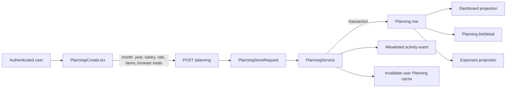

# Expense-planning domain

This explanation gives product, design, and engineering work one vocabulary for the monthly Planning workflow. It separates what the application does today from the financial contract that issue [#63](https://github.com/lurzar/expenses-app/issues/63) must make authoritative.

## Product boundary

Expenses App currently stores a **monthly plan**, not individual financial transactions. A user enters expected monthly income and named allocations in three sections. Dashboard, Planning, and Expenses are different projections of the same `Planning` record.

There is no expense-entry model, cleared/pending state, merchant, transaction date, bank feed, recurring-payment engine, or ledger. The Expenses module must not be described as actual-spend tracking until a separate feature introduces and documents those concepts.

## Canonical vocabulary

| Term | Canonical meaning | Current representation | Target rule for #63 |
| --- | --- | --- | --- |
| User | The authenticated owner of a monthly plan | `users.id` is the relation key; `user_id` is the public ULID | Every read and mutation remains owner-scoped |
| Planning / monthly plan | One user's allocation plan for one calendar month | One `plannings` row with month/year strings | At most one active plan per user and calendar month |
| Monthly income | Money available to allocate in the plan; the UI currently labels it Salary | `salary` float submitted as a string | MYR decimal input, converted to integer sen for calculation |
| Saving rate | Percentage used to calculate a target, not an allocation itself | Browser input defaults to 20; server accepts any string | A number from 0 through 100; round its target once to the nearest sen, half up |
| Target savings | Advisory amount implied by income and saving rate | Calculated in React and submitted as `totals.saving` | `round(income × rate / 100)`; derived by the server |
| Savings item | Named amount allocated to retained money, such as an emergency fund | `{item, amount}` inside `sections.savings` JSON | Non-empty name and non-negative MYR amount with at most two decimals |
| Commitment item | Named expected contractual/recurring outflow | `{item, amount}` inside `sections.commitments` JSON | Same validation and precision as a savings item |
| Other item | Named expected discretionary or uncategorized outflow | `{item, amount}` inside `sections.others` JSON | Same validation and precision as a savings item |
| Actual savings allocation | Sum of savings-item amounts | Recomputed by React display pages | Derived by the server from normalized items |
| Spending | Expected outflow: commitments plus other items; savings are not spending | The term is currently inconsistent; see divergences below | `commitments + others` |
| Total allocated | All money assigned by the plan | Recomputed by display pages, but not named consistently | `savings + commitments + others` |
| Balance | Unallocated income remaining after every section | Browser-submitted `totals.balance` and display recomputation | `income - total allocated` |
| Expenses projection | Planning data presented through `/expenses` | Reads `Planning`; no separate persistence | Remains a plan projection until a ledger issue is approved |

Unless a future multi-currency issue changes the contract, all monetary examples and persisted amounts are Malaysian Ringgit (MYR). Display uses `RM`; calculations use sen so binary floating-point cannot change financial results.

## Current lifecycle



1. The authenticated browser opens `Planning/Create.tsx`; month/year default to the current client date.
2. React parses the input strings as JavaScript numbers and previews target savings, section sums, cascade balances, and final balance.
3. Submission includes the raw section items and a browser-built `totals` object.
4. `PlanningStoreRequest` validates only broad string/array shape. It does not enforce financial precision, bounds, valid calendar values, or uniqueness.
5. `PlanningService` renames the three `*_values` arrays into `sections`, discards `saving_rate`, trusts `salary` and `totals`, and persists within an activity-recording transaction.
6. Dashboard and Expenses query the same user-owned Planning collection. Planning/Expenses detail routes authorize the bound record with `PlanningPolicy`.

## Current formulas and divergences

`Planning/Create.tsx` currently calculates:

```text
target savings       = salary × saving rate / 100
savings allocation  = sum(savings item amounts)
commitments          = sum(commitment item amounts)
other                = sum(other item amounts)
balance              = salary - savings allocation - commitments - other
```

It submits singular total keys:

```json
{
  "saving": "target savings",
  "balance": "remaining balance",
  "commitment": "commitments sum",
  "other": "other sum"
}
```

The current code then disagrees about those values:

- `resources/js/types/index.ts` declares plural `savings`, `commitments`, and `others`, so the TypeScript contract does not match stored keys.
- Dashboard reads `totals.savings`, while creation submits `totals.saving`.
- `Planning::spending` sums every persisted total, including target savings and remaining balance; that is neither spending nor total allocation.
- Planning and Expenses detail pages ignore persisted totals and recompute all section amounts, counting savings inside their displayed `totalSpending`.
- `salary` is cast to float, item amounts remain strings inside JSON, and JavaScript `parseFloat` performs authoritative-looking previews.
- The saving-rate target and actual savings allocation can differ without a warning or invariant.

These are verified current behaviors, not definitions to preserve. #63 owns their replacement.

## Worked current example

For RM 5,000 income, a 20% saving rate, RM 800 of savings items, RM 2,000 of commitments, and RM 700 of other items:

| Result | Amount |
| --- | ---: |
| Target savings | RM 1,000.00 |
| Actual savings allocation | RM 800.00 |
| Spending (`commitments + other`) | RM 2,700.00 |
| Total allocated | RM 3,500.00 |
| Balance | RM 1,500.00 |

The browser currently persists `saving=1000`, `balance=1500`, `commitment=2000`, and `other=700`. `Planning::spending` sums those fields to RM 5,200.00, while Planning/Expenses detail recomputes RM 3,500.00 and labels it spending. The target contract instead calls RM 2,700.00 spending and RM 3,500.00 total allocated.

## Authoritative target contract for #63

The approved v2.1.4 implementation should use these invariants:

1. The server is authoritative. It accepts raw income, rate, and items; it never accepts client totals as truth.
2. Parse each MYR value as a decimal with at most two fractional digits, calculate in integer sen, and reject scientific notation, `NaN`, infinity, negatives, or excessive precision.
3. Round only the percentage-derived target savings, once, half up to the nearest sen. Section sums and balance require no intermediate rounding after normalization to sen.
4. Persist or derive one consistent total contract: `target_savings`, `savings`, `commitments`, `others`, `spending`, `allocated`, and `balance`.
5. `spending = commitments + others`; `allocated = savings + spending`; `balance = income - allocated`.
6. Reject a negative balance. A target-savings shortfall may be shown, but it does not silently change actual savings.
7. Store calendar month as 1 through 12 and year as a bounded integer; enforce one non-deleted plan per user/month/year at both request and database boundaries.
8. Preserve owner scoping, transaction/activity atomicity, public ULID routing, and post-commit cache invalidation.
9. Return validation errors through the existing Inertia form flow; do not add an API or ledger as part of #63.

The browser may calculate a preview for responsiveness, but it must render the normalized totals returned by the server after persistence.

## Current versus future behavior

| Capability | Current | Approved target / owner |
| --- | --- | --- |
| Monthly allocation plan | Implemented | Preserve and harden in #63 |
| Server-authoritative totals | Not implemented | #63 |
| Exact MYR precision and rounding | Not implemented | #63 |
| One active user/month plan | Not enforced | #63 |
| Expense-entry ledger | Not implemented | Future feature issue after UI/UX decisions |
| Public HTTP API | Not implemented | Governance only in #58; endpoint work requires a consumer-specific issue |
| Multi-currency support | Not implemented | Separate product/domain issue |

## Open product decisions

These do not change the v2.1.4 integrity defaults above, but must be answered before expanding the product:

1. `[ASK USER]` Should Monthly income mean net take-home salary only, or may it combine salary and other income sources?
2. `[ASK USER]` Should a savings allocation below target be informational, a warning requiring acknowledgement, or a blocking validation error?
3. `[ASK USER]` When a ledger exists, should commitments become recurring templates, planned transactions, or remain plan-only categories?
4. `[ASK USER]` What maximum plan history should the three collection screens show before pagination or period filtering is mandatory?

## Evidence

- `app/Modules/Planning/Requests/PlanningStoreRequest.php`
- `app/Modules/Planning/Services/PlanningService.php`
- `app/Modules/Planning/Models/Planning.php`
- `app/Modules/Planning/database/migrations/2023_04_22_001522_create_plannings_table.php`
- `app/Modules/Planning/Controllers/PlanningController.php`
- `app/Modules/Dashboard/Controllers/DashboardController.php`
- `app/Modules/Expenses/Controllers/ExpensesController.php`
- `resources/js/Pages/Planning/Create.tsx`
- `resources/js/Pages/Planning/Show.tsx`
- `resources/js/Pages/Expenses/Show.tsx`
- `resources/js/types/index.ts`
- `docs/codebase/ARCHITECTURE.md`
