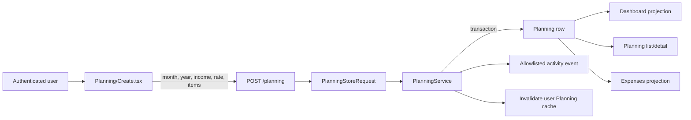

# Expense-planning domain

This explanation gives product, design, and engineering work one vocabulary for the monthly Planning workflow. Issue [#63](https://github.com/lurzar/expenses-app/issues/63) and [ADR 0001](../decisions/0001-planning-money-integrity.md) make the fixed-precision contract below authoritative in v2.1.4.

## Product boundary

Expenses App currently stores a **monthly plan**, not individual financial transactions. A user enters expected monthly income and named allocations in three sections. Dashboard, Planning, and Expenses are different projections of the same `Planning` record.

There is no expense-entry model, cleared/pending state, merchant, transaction date, bank feed, recurring-payment engine, or ledger. The Expenses module must not be described as actual-spend tracking until a separate feature introduces and documents those concepts.

## Canonical vocabulary

| Term | Canonical meaning | Authoritative v2.1.4 representation | Rule |
| --- | --- | --- | --- |
| User | The authenticated owner of a monthly plan | `plannings.user_id` references numeric `users.id`; `users.user_id` is the public ULID | Every read and mutation remains owner-scoped |
| Planning / monthly plan | One user's allocation plan for one calendar month | Integer month/year on one `plannings` row | At most one active plan per user and calendar month |
| Monthly income | Combined net/available money for this plan; the form retains Salary as transitional copy | `DECIMAL(14,2)` exposed as an exact string | MYR decimal input converted to integer sen for calculation and persisted without a float |
| Saving rate | Percentage used to calculate a target, not an allocation itself | `DECIMAL(5,2)` and integer basis points during calculation | Decimal percentage from 0.00 through 100.00 with at most two fractional digits |
| Target savings | Advisory amount implied by income and saving rate | Canonical `totals.target_savings` decimal string | Half-up `income_sen × rate_basis_points / 10,000`; derived by the server |
| Savings item | Named amount allocated to retained money, such as an emergency fund | `{item, amount}` inside `sections.savings` JSON | Non-empty name and non-negative MYR amount with at most two decimals |
| Commitment item | Named expected contractual/recurring outflow | `{item, amount}` inside `sections.commitments` JSON | Same validation and precision as a savings item |
| Other item | Named expected discretionary or uncategorized outflow | `{item, amount}` inside `sections.others` JSON | Same validation and precision as a savings item |
| Actual savings allocation | Sum of savings-item amounts | Canonical `totals.savings` decimal string | Derived by the server from normalized items |
| Spending | Expected outflow: commitments plus other items; savings are not spending | Canonical `totals.spending` decimal string | `commitments + others` |
| Total allocated | All money assigned by the plan | Canonical `totals.allocated` decimal string | `savings + commitments + others` |
| Balance | Unallocated income remaining after every section | Canonical `totals.balance` decimal string | `income - total allocated`; negative new plans are rejected |
| Expenses projection | Planning data presented through `/expenses` | Reads `Planning`; no separate persistence | Remains a plan projection until a ledger issue is approved |

All current examples are Malaysian Ringgit (MYR). Authoritative calculation uses integer sen so binary floating-point cannot change financial results. React uses the same integer boundary only for previews and renders persisted server values after save.

## Authoritative lifecycle



1. The authenticated browser opens `Planning/Create.tsx`; month/year default to the current client date.
2. React uses one BigInt/sen helper to preview target savings, section sums, and balance without becoming authoritative.
3. Submission includes period, income, saving rate, and raw section items. Any submitted `totals` are excluded.
4. `PlanningStoreRequest` validates decimal precision/bounds, calendar bounds, array/name limits, non-negative balance, and active owner/period uniqueness.
5. `PlanningService` uses `PlanningCalculator` to normalize sections and calculate every canonical total, then persists the plan and activity atomically.
6. Dashboard and Expenses query the same user-owned Planning collection. Planning and Expenses detail routes bind the public ULID and authorize the owner through `PlanningPolicy`; collection and detail pages receive an explicit public-ID payload without numeric Planning/user IDs.

## Legacy divergences resolved by #63

Before v2.1.4, `Planning/Create.tsx` calculated:

```text
target savings       = salary × saving rate / 100
savings allocation  = sum(savings item amounts)
commitments          = sum(commitment item amounts)
other                = sum(other item amounts)
balance              = salary - savings allocation - commitments - other
```

It submitted singular total keys:

```json
{
  "saving": "target savings",
  "balance": "remaining balance",
  "commitment": "commitments sum",
  "other": "other sum"
}
```

The legacy code then disagreed about those values:

- `resources/js/types/index.ts` declares plural `savings`, `commitments`, and `others`, so the TypeScript contract does not match stored keys.
- Dashboard reads `totals.savings`, while creation submits `totals.saving`.
- `Planning::spending` sums every persisted total, including target savings and remaining balance; that is neither spending nor total allocation.
- Planning and Expenses detail pages ignore persisted totals and recompute all section amounts, counting savings inside their displayed `totalSpending`.
- `salary` is cast to float, item amounts remain strings inside JSON, and JavaScript `parseFloat` performs authoritative-looking previews.
- The saving-rate target and actual savings allocation can differ without a warning or invariant.

These are historical behaviors, not definitions to preserve. #63 replaces them with the authoritative contract below.

## Worked authoritative example

For RM 5,000 income, a 20% saving rate, RM 800 of savings items, RM 2,000 of commitments, and RM 700 of other items:

| Result | Amount |
| --- | ---: |
| Target savings | RM 1,000.00 |
| Actual savings allocation | RM 800.00 |
| Spending (`commitments + other`) | RM 2,700.00 |
| Total allocated | RM 3,500.00 |
| Balance | RM 1,500.00 |

The server persists target savings `1000.00`, savings `800.00`, commitments `2000.00`, others `700.00`, spending `2700.00`, allocated `3500.00`, and balance `1500.00` as canonical decimal strings. All three projections receive that same payload.

## Authoritative v2.1.4 contract

The following contract is approved and implemented by #63 for v2.1.4.

1. The server is authoritative. It accepts raw income, rate, and items; it never accepts client totals as truth.
2. Parse each MYR value as a decimal with at most two fractional digits, calculate in integer sen, and reject scientific notation, `NaN`, infinity, negatives, or excessive precision. Persistence uses fixed `DECIMAL(14,2)` for income and canonical two-decimal strings for section/total JSON amounts; model casts must not convert money to float.
3. Parse saving rate from 0.00 through 100.00 with at most two fractional digits into integer basis points (0 through 10,000). Round only `income_sen × rate_basis_points / 10,000`, once, half up to the nearest sen. Section sums and balance require no intermediate rounding after normalization to sen.
4. Persist or derive one consistent total contract: `target_savings`, `savings`, `commitments`, `others`, `spending`, `allocated`, and `balance`.
5. `spending = commitments + others`; `allocated = savings + spending`; `balance = income - allocated`.
6. Reject a negative balance. A target-savings shortfall may be shown, but it does not silently change actual savings.
7. Store calendar month as an integer from 1 through 12 and year from 2000 through 2100. Enforce one non-deleted plan per user/month/year at request and PostgreSQL partial-unique-index boundaries.
8. Preserve owner scoping, transaction/activity atomicity, public ULID routing, and post-commit cache invalidation.
9. Return validation errors through the existing Inertia form flow; do not add an API or ledger as part of #63.

The browser may calculate a preview for responsiveness, but it must render the normalized totals returned by the server after persistence.

## Current versus future behavior

| Capability | Current | Future owner |
| --- | --- | --- |
| Monthly allocation plan | Implemented and hardened | Preserve |
| Server-authoritative totals | Implemented in v2.1.4 | Preserve |
| Exact MYR precision and rounding | Implemented in v2.1.4 | Preserve |
| One active user/month plan | Implemented in v2.1.4 | Preserve |
| Expense-entry ledger | Not implemented | Future feature issue after UI/UX decisions |
| Public HTTP API | Not implemented | Governance only in #58; endpoint work requires a consumer-specific issue |
| Multi-currency support | Not implemented | Separate product/domain issue |

## Remaining product decisions

The v2.1.4 contract resolves representation, rounding, period uniqueness, combined net/available monthly income, and informational savings shortfall. Later expansion still requires explicit decisions:

1. `[ASK USER]` When a ledger exists, should commitments become recurring templates, planned transactions, or remain plan-only categories?
2. `[ASK USER]` What maximum plan history should the three collection screens show before pagination or period filtering is mandatory?

## Evidence

- `app/Modules/Planning/Requests/PlanningStoreRequest.php`
- `app/Modules/Planning/Services/PlanningService.php`
- `app/Modules/Planning/Models/Planning.php`
- `app/Modules/Planning/Database/Migrations/2023_04_22_001522_create_plannings_table.php`
- `app/Modules/Planning/Database/Migrations/2026_08_16_000000_enforce_planning_money_integrity.php`
- `app/Modules/Planning/Controllers/PlanningController.php`
- `app/Modules/Dashboard/Controllers/DashboardController.php`
- `app/Modules/Expenses/Controllers/ExpensesController.php`
- `resources/js/Pages/Planning/Create.tsx`
- `resources/js/Pages/Planning/Show.tsx`
- `resources/js/Pages/Expenses/Show.tsx`
- `resources/js/types/index.ts`
- `docs/codebase/ARCHITECTURE.md`
